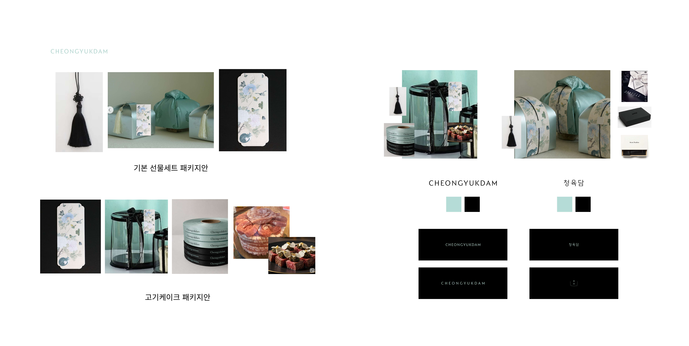
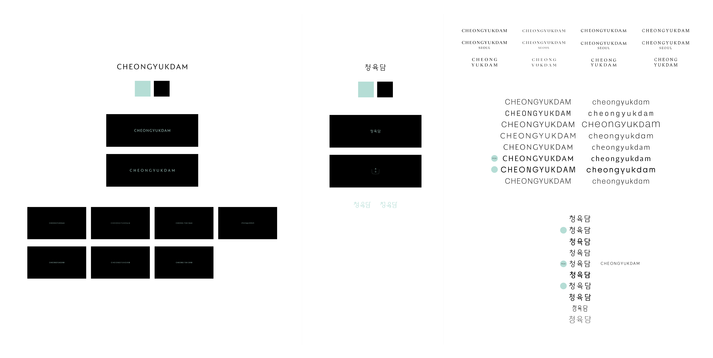
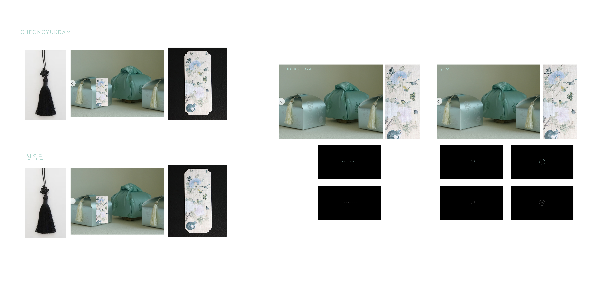

# 브랜딩 청육담

> 원본: Notion › J&M COMPANY › 브랜딩 청육담 (최종 수정 2026-07-05)

## 1. 브랜드 핵심 컨셉 (Core Message)

- **브랜드명:** **청육담 (淸肉潭)**
  - *의미: 맑고 청량한 젊음의 감각(淸)으로, 40년 장인의 깊고 깊은 육(肉)의 내공을 담아내는 못(潭).*
- **최종 확정 슬로건:**
  - *"40년 거장의 깊은 내공을, 청량한 감각으로 담아내다. 청육담"*
  - *"경험 없는 청년의 비싼 단가도, 감각 없는 장인의 투박함도 아닌, 육(肉)의 가장 깊은 완성."*
  - *"과장된 지방과 유통 마진은 덜어내고, 40년의 깊은 진심만 담습니다."*

### 淸 (맑을 청)
- **기본 의미:** 맑다, 깨끗하다, 청결하다.
- **브랜드적 해석:**
  - 편법이나 과장(과도한 지방, 복잡한 유통 마진)이 없는 **투명하고 정직한 신뢰**를 의미합니다.
  - 동시에 고리타분하지 않고 트렌디한 **젊고 청량한 감각**을 상징합니다.

### 肉 (고기 육)
- **기본 의미:** 고기, 살.
- **브랜드적 해석:**
  - 브랜드의 본질이자 핵심 카테고리인 '최고 품질의 고기(한우)'를 정직하게 드러냅니다.

### 潭 (못 담)
- **기본 의미:** 못(깊고 넓은 물줄기), 깊다, 깊숙이 빠지다.
- **브랜드적 해석:**
  - 가볍게 고여 있는 물이 아닌, 오랜 세월 깊어진 **40년 장인의 깊고 단단한 내공과 진심**을 뜻합니다.
  - 깊은 못에 맑은 물이 가득 차듯, 고기의 깊은 풍미와 가치를 온전히 채워 담아내는 공간(브랜드)을 의미합니다.

## 2. 브랜드 스토리텔링 (상세페이지 도입부)

> **[ 40년 거장의 깊은 내공을, 청량한 감각으로 담아내다 : 청육담(淸肉潭) ]**

"온라인에서 '예쁘고 트렌디한 고기'를 찾다 보면, 생각보다 높은 가격과 아쉬운 품질에 망설이게 됩니다. 경험이 부족한 청년 브랜드들은 직접 원육을 다루는 인프라가 없어 단가가 높아지거나 품질이 불완전하기 때문입니다. 반대로 수수께끼 같은 수십 년 경력의 노포들은 고기는 훌륭하지만, 투박한 스티로폼 포장에 머물러 있어 소중한 날을 위한 선물로는 아쉬움이 남습니다.

저희는 그 정체된 시장의 경계에서 생각했습니다. **'40년이 넘는 세월 동안 시장을 지켜온 거장의 깊은 기술과 유통망 위에, 청년들의 맑고 세련된 감각이 더해진다면 어떨까?'**

그렇게 장인의 깊은 내공을 맑은 감각으로 담아내는 공간, **청육담(淸肉潭)**이 탄생했습니다.

청육담은 40년 동안 축산물 유통과 육가공의 최전선에서 칼을 잡아 온 이모부님의 견고한 내공에서 출발합니다. 오랜 세월 다져진 원육 직소싱 능력으로 중간 마진을 완전히 걷어내어, 타 청년 브랜드가 흉내 낼 수 없는 **'압도적인 비용 우위와 독보적인 고기 질'**을 확보했습니다.

그리고 그 깊은 샘물 위에, 저희 청년들의 현대적인 미학을 맑게 띄웠습니다.

청육담에서는 트렌디함을 얻기 위해 품질을 포기하거나, 높은 가격을 감당할 필요가 없습니다. 40년의 깊은 내공이 보장하는 정직한 가격과 완벽한 육질, 그리고 청춘이 빚어낸 단아한 패키징. 이 가장 완벽한 교차점을 당신의 식탁 위에 올립니다."

## 3. 사업계획서용 브랜드 정체성 (Brand Identity)

- **브랜드 네이밍 전략:** 기존의 일차원적인 '정육점', '축산'이라는 명칭을 탈피하여, 맑음(淸)과 깊음(潭)이라는 대조적 가치를 결합함. 이는 '2030 청년 창업가의 트렌디한 감각'과 '40년 장인의 깊은 내공 및 유통 인프라'라는 청육담만의 핵심 역량 구조를 은유적으로 표현한 네이밍임.
- **시각적 디자인 큐레이션:**
  깊은 못을 형상화하는 묵직한 묵색(Matte Black) 케이크 박스로 신뢰감과 무게감을 확보하고, 그 위를 흐르는 전통 옥빛(Jade Mint, `#b8d4c8`)의 민화 띠지를 통해 청청하고 맑은 감각을 투영. 시각적 격식을 극대화하여 프리미엄 선물(Gift) 시장의 D2C 점유율을 견인함.

## 첨부 이미지

